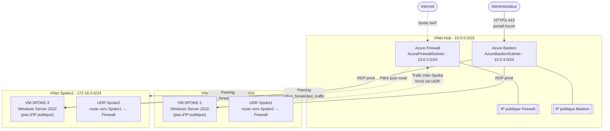

# Azure Hub & Spoke - Infrastructure as Code avec Terraform


## Auteur 

**LO Pape** - [pape.lo@estiam.com](mailto:pape.lo@estiam.com)

Projet : `AZ-PRO-HUB-SPOKE-NORWAY` · Région : `norwayeast` · Environnement de développement : Cloud Shell

## Description
Déploiement automatisé et 100 % reproductible d'une architecture réseau **Hub & Spoke** sécurisée sur Microsoft Azure, entièrement modularisée en Terraform.

---
 
## Sommaire

- [Aperçu du projet](#aperçu-du-projet)
- [Architecture](#architecture)
- [Schéma du réseau](#schéma-du-réseau)
- [Flux de trafic et sécurité](#flux-de-trafic-et-sécurité)
- [Structure du dépôt](#structure-du-dépôt)
- [Modules Terraform](#modules-terraform)
- [Plan d'adressage IP](#plan-dadressage-ip)
- [Variables d'entrée](#variables-dentrée)
- [Sorties (outputs)](#sorties-outputs)
- [Prérequis](#prérequis)
- [Checklist avant le premier déploiement](#checklist-avant-le-premier-déploiement)
- [Installation et déploiement](#installation-et-déploiement)
- [Connexion aux machines virtuelles](#connexion-aux-machines-virtuelles)
- [Tests de validation](#tests-de-validation)
- [Nettoyage des ressources](#nettoyage-des-ressources)
- [Bonnes pratiques de sécurité](#bonnes-pratiques-de-sécurité)
- [Gestion du state Terraform](#gestion-du-state-terraform)
- [Intégration continue (GitHub Actions)](#intégration-continue-github-actions)
- [Observabilité (Log Analytics)](#observabilité-log-analytics)
- [Estimation des coûts](#estimation-des-coûts)
- [Pistes d'amélioration](#pistes-damélioration)
- [Dépannage (Troubleshooting)](#dépannage-troubleshooting)
- [Licence](#licence)
- [Auteur](#auteur)

---

## Aperçu du projet

Ce projet déploie, via **Terraform**, une architecture réseau Azure de type **Hub & Spoke** - un modèle de référence largement adopté en entreprise pour centraliser la sécurité et la gouvernance réseau tout en isolant les charges applicatives.

Un **VNet Hub** central héberge les services de sécurité partagés (pare-feu, bastion), tandis que deux **VNets Spoke** hébergent chacun une charge de travail applicative (une VM Windows Server). Tout le trafic entre les Spokes est **forcé de transiter par le Firewall central** grâce à des tables de routage définies par l'utilisateur (UDR), et l'accès administratif aux VMs se fait exclusivement via **Azure Bastion**, sans aucune IP publique exposée sur les machines virtuelles.

**Points clés du projet :**

| Caractéristique | Détail |
|---|---|
| Infrastructure as Code | 100 % Terraform, modulaire et réutilisable |
| Idempotence | `terraform apply` peut être rejoué sans dupliquer ou casser les ressources |
| Sécurité réseau | Aucune IP publique sur les VMs, inspection centralisée du trafic inter-Spoke |
| Accès administratif | Azure Bastion (RDP/SSH via portail, sans IP publique ni agent) |
| Automatisation | Next-hop du Firewall calculé automatiquement (plus de saisie manuelle) |
| Secrets | Mot de passe VM généré automatiquement (`random_password`) et stocké dans Azure Key Vault |
| State | Backend distant Terraform Cloud (verrouillage automatique, sans Storage Account à gérer) |
| Observabilité | Log Analytics + Diagnostic Settings (Firewall, Bastion, NSG) + NSG Flow Logs |
| CI/CD | Pipeline GitHub Actions (`fmt`, `validate`, `tflint`, `checkov`, `plan`) |

---

## Architecture

L'architecture repose sur un **VNet Hub** central connecté à deux **VNets Spoke** par peering VNet bidirectionnel. Le Hub concentre les composants de sécurité et d'administration partagés par l'ensemble de la plateforme.

- **VnetHub** (`10.0.0.0/16`) - contient :
  - `AzureFirewallSubnet` → Azure Firewall (inspection et filtrage du trafic inter-Spoke)
  - `AzureBastionSubnet` → Azure Bastion (point d'accès administratif unique)
  - `Prod` → réservé à de futures ressources centrales
- **VnetSpoke1** (`192.168.0.0/24`) - sous-réseau `Prod` hébergeant `VM-SPOKE-1`
- **VnetSpoke2** (`172.16.0.0/24`) - sous-réseau `Prod` hébergeant `VM-SPOKE-2`

Le trafic entre Spoke1 et Spoke2 ne passe **jamais directement** par le peering : des routes définies par l'utilisateur (UDR) forcent ce trafic à transiter par l'IP privée de l'Azure Firewall, qui applique ensuite ses règles de filtrage réseau avant de router le paquet vers sa destination.

## Schéma du réseau



## Flux de trafic et sécurité

| Flux | Chemin | Contrôle appliqué |
|---|---|---|
| Administrateur → VM-SPOKE-1 / VM-SPOKE-2 | Portail Azure → Azure Bastion → NIC privée de la VM | Aucune IP publique sur les VMs ; accès centralisé via Bastion |
| VM-SPOKE-1 → VM-SPOKE-2 | Peering Spoke1↔Hub → UDR → Azure Firewall → Peering Hub↔Spoke2 | Règle réseau `Spoke1-to-Spoke2-Ping` (ICMP) sur le Firewall |
| VM-SPOKE-2 → VM-SPOKE-1 | Peering Spoke2↔Hub → UDR → Azure Firewall → Peering Hub↔Spoke1 | Règle réseau `Spoke2-to-Spoke1-Ping` (ICMP) sur le Firewall |
| VM → Internet | Sortie via SNAT du Firewall (IP publique associée) | Filtrage centralisé, traçable |
| Trafic entrant non sollicité | - | Bloqué : NSG sur chaque subnet `Prod`, aucune IP publique exposée |

Chaque subnet `Prod` (Spoke1 et Spoke2) est également protégé par un **Network Security Group** dédié, qui n'autorise explicitement que le trafic ICMP entrant nécessaire aux tests de connectivité - tout le reste est implicitement refusé par les règles par défaut d'Azure.

---

## Structure du dépôt

```
AzureHubSpokeTerraform/
├── main.tf                       # Assemblage de tous les modules
├── variables.tf                  # Variables racine (adressage, tailles, tags...)
├── outputs.tf                    # IP Firewall, IP VMs, DNS Bastion, Key Vault, Log Analytics...
├── providers.tf                  # Providers azurerm/random + backend Terraform Cloud
├── terraform.tfvars.example      # Modèle de fichier de variables à copier
├── .tflint.hcl                   # Config TFLint (ruleset azurerm)
├── .gitignore                    # Exclusion des states et secrets
├── .github/
│   └── workflows/
│       └── terraform.yml         # Pipeline CI : fmt, validate, tflint, checkov, plan
├── LICENSE                       # Licence MIT
├── README.md
└── modules/
    ├── resource_group/           # Groupe de ressources
    │   ├── main.tf
    │   ├── variables.tf
    │   └── outputs.tf
    ├── network/                  # VNet + subnets (réutilisé pour Hub / Spoke1 / Spoke2)
    │   ├── main.tf
    │   ├── variables.tf
    │   └── outputs.tf
    ├── nsg/                      # Network Security Group + règles + association subnet
    │   ├── main.tf
    │   ├── variables.tf
    │   └── outputs.tf
    ├── vm/                       # VM Windows Server 2022, sans IP publique
    │   ├── main.tf
    │   ├── variables.tf
    │   └── outputs.tf
    ├── firewall/                 # Azure Firewall + IP publique + règles réseau
    │   ├── main.tf
    │   ├── variables.tf
    │   └── outputs.tf
    ├── route_table/               # UDR + routes + association subnet
    │   ├── main.tf
    │   ├── variables.tf
    │   └── outputs.tf
    ├── peering/                   # Peering VNet (instancié 2x par paire Hub/Spoke)
    │   ├── main.tf
    │   ├── variables.tf
    │   └── outputs.tf
    ├── bastion/                   # Azure Bastion + IP publique
    │   ├── main.tf
    │   ├── variables.tf
    │   └── outputs.tf
    ├── key_vault/                 # Key Vault + secrets (identifiants VM générés)
    │   ├── main.tf
    │   ├── variables.tf
    │   └── outputs.tf
    ├── log_analytics/             # Workspace Log Analytics central
    │   ├── main.tf
    │   ├── variables.tf
    │   └── outputs.tf
    ├── diagnostic_setting/        # Module générique : branche une ressource sur Log Analytics
    │   ├── main.tf
    │   ├── variables.tf
    │   └── outputs.tf
    └── flow_log/                  # NSG Flow Logs (Network Watcher + Storage Account)
        ├── main.tf
        ├── variables.tf
        └── outputs.tf
```

Le projet suit une architecture **100 % modulaire** : chaque brique Azure (réseau, sécurité, calcul, routage) est isolée dans son propre module Terraform, réutilisable et testable indépendamment. Le fichier `main.tf` à la racine agit comme un **orchestrateur** qui assemble ces modules dans le bon ordre logique.

---

## Modules Terraform

| Module | Ressources Azure créées | Rôle |
|---|---|---|
| `resource_group` | `azurerm_resource_group` | Conteneur logique de toutes les ressources du projet |
| `network` | `azurerm_virtual_network`, `azurerm_subnet` | Création générique d'un VNet et de ses subnets (réutilisé 3 fois : Hub, Spoke1, Spoke2) |
| `nsg` | `azurerm_network_security_group`, `azurerm_network_security_rule`, `azurerm_subnet_network_security_group_association` | Filtrage du trafic au niveau subnet, règles dynamiques |
| `vm` | `azurerm_network_interface`, `azurerm_windows_virtual_machine` | VM Windows Server 2022, carte réseau sans IP publique |
| `firewall` | `azurerm_public_ip`, `azurerm_firewall`, `azurerm_firewall_network_rule_collection` | Pare-feu centralisé, règles réseau générées dynamiquement |
| `route_table` | `azurerm_route_table`, `azurerm_route`, `azurerm_subnet_route_table_association` | UDR forçant le trafic inter-Spoke via le Firewall |
| `peering` | `azurerm_virtual_network_peering` | Peering VNet à sens unique (instancié deux fois pour une liaison bidirectionnelle) |
| `bastion` | `azurerm_public_ip`, `azurerm_bastion_host` | Point d'accès administratif unique, sans exposition des VMs |
| `key_vault` | `azurerm_key_vault`, `azurerm_key_vault_secret` | Stockage sécurisé des identifiants VM générés (`random_password`) |
| `log_analytics` | `azurerm_log_analytics_workspace` | Workspace central de collecte des logs (quota quotidien plafonné) |
| `diagnostic_setting` | `azurerm_monitor_diagnostic_setting` | Module générique reliant Firewall/Bastion/NSG au workspace Log Analytics |
| `flow_log` | `azurerm_network_watcher_flow_log` | Capture du trafic réel autorisé/bloqué par chaque NSG |

### Ordre de déploiement logique (géré automatiquement par le graphe Terraform)

1. **Groupe de ressources**
2. **Secrets** : génération du mot de passe VM (`random_password`) et stockage dans **Key Vault**
3. **Réseaux virtuels** (Hub, Spoke1, Spoke2) et leurs sous-réseaux
4. **Network Security Groups** et association aux subnets `Prod`
5. **Machines virtuelles** (dépendent des NSG via `depends_on`)
6. **Azure Firewall** et règles de filtrage inter-Spoke
7. **Tables de routage (UDR)** - le next-hop est calculé automatiquement à partir de l'IP privée du Firewall (`module.firewall.private_ip_address`)
8. **Peering VNet** Hub↔Spoke1 et Hub↔Spoke2 (bidirectionnel, `allow_forwarded_traffic = true`)
9. **Azure Bastion**
10. **Log Analytics + Diagnostic Settings** sur le Firewall, le Bastion et les NSG
11. **NSG Flow Logs** (Network Watcher + compte de stockage dédié)

Terraform résout ces dépendances via son graphe de ressources ; aucune intervention manuelle sur l'ordre n'est nécessaire.

---

## Plan d'adressage IP

| Réseau | Plage CIDR | Sous-réseau | Plage du sous-réseau | Usage |
|---|---|---|---|---|
| VnetHub | `10.0.0.0/16` | AzureFirewallSubnet | `10.0.2.0/24` | Azure Firewall (nom réservé Azure) |
| VnetHub | `10.0.0.0/16` | AzureBastionSubnet | `10.0.4.0/24` | Azure Bastion (nom réservé Azure) |
| VnetHub | `10.0.0.0/16` | Prod | `10.0.1.0/24` | Réservé, extension future |
| VnetSpoke1 | `192.168.0.0/24` | Prod | `192.168.0.0/24` | VM-SPOKE-1 |
| VnetSpoke2 | `172.16.0.0/24` | Prod | `172.16.0.0/24` | VM-SPOKE-2 |

Les noms `AzureFirewallSubnet` et `AzureBastionSubnet` sont des **noms réservés par Azure** : ils doivent être utilisés tels quels, sans variation, pour que les services correspondants puissent y être déployés.

---

## Variables d'entrée

Ces variables sont définies dans `variables.tf` à la racine et peuvent être surchargées via `terraform.tfvars` ou des variables d'environnement `TF_VAR_*`.

| Variable | Type | Valeur par défaut | Description |
|---|---|---|---|
| `resource_group_name` | `string` | `RG-HUB-SPOKE-PROJECT` | Nom du groupe de ressources |
| `location` | `string` | `norwayeast` | Région Azure de déploiement |
| `admin_username` | `string` | `azure_admin` | Identifiant administrateur des VMs |
| `admin_password` | `string` *(sensible)* | `null` | Mot de passe VM - utilisé uniquement si `generate_admin_password = false` |
| `generate_admin_password` | `bool` | `true` | Génère un mot de passe VM aléatoire (`random_password`) stocké dans Key Vault |
| `vm_size` | `string` | `Standard_B2s` | Taille des machines virtuelles |
| `firewall_sku_tier` | `string` | `Standard` | Tier du SKU Azure Firewall (`Standard`, `Premium` ou `Basic`) |
| `hub_address_space` | `list(string)` | `["10.0.0.0/16"]` | Plage d'adresses du VNet Hub |
| `hub_prod_subnet_prefix` | `list(string)` | `["10.0.1.0/24"]` | Sous-réseau Prod du Hub |
| `hub_firewall_subnet_prefix` | `list(string)` | `["10.0.2.0/24"]` | Sous-réseau du Firewall |
| `hub_bastion_subnet_prefix` | `list(string)` | `["10.0.4.0/24"]` | Sous-réseau du Bastion |
| `spoke1_address_space` | `list(string)` | `["192.168.0.0/24"]` | Plage d'adresses de Spoke1 |
| `spoke2_address_space` | `list(string)` | `["172.16.0.0/24"]` | Plage d'adresses de Spoke2 |
| `tags` | `map(string)` | `{ projet, environment, gere_par }` | Tags communs appliqués à toutes les ressources |
| `log_retention_in_days` | `number` | `30` | Durée de rétention des logs dans Log Analytics |
| `log_daily_quota_gb` | `number` | `0.5` | Plafond quotidien d'ingestion (Go) - maîtrise du coût |
| `enable_nsg_flow_logs` | `bool` | `true` | Active les NSG Flow Logs (nécessite Network Watcher sur l'abonnement) |

---

## Sorties (outputs)

Après un `terraform apply` réussi, les valeurs suivantes sont affichées (définies dans `outputs.tf`) :

| Output | Description |
|---|---|
| `resource_group_name` | Nom du groupe de ressources créé |
| `firewall_public_ip` | IP publique de sortie du Firewall |
| `firewall_private_ip` | IP privée du Firewall, utilisée comme next-hop dans les UDR |
| `bastion_dns_name` | Nom DNS d'Azure Bastion |
| `vm_spoke1_private_ip` | IP privée de VM-SPOKE-1 |
| `vm_spoke2_private_ip` | IP privée de VM-SPOKE-2 |
| `key_vault_name` | Nom du Key Vault contenant les identifiants VM générés |
| `key_vault_uri` | URI du Key Vault |
| `log_analytics_workspace_name` | Nom du workspace Log Analytics |
| `log_analytics_workspace_id` | Workspace ID (GUID), utile pour les requêtes KQL |

Consulter une sortie individuelle après déploiement :

```bash
terraform output firewall_public_ip
terraform output -json
```

---

## Prérequis

- [Terraform](https://developer.hashicorp.com/terraform/downloads) ≥ 1.6.0
- [Azure CLI](https://learn.microsoft.com/cli/azure/install-azure-cli) installée et authentifiée (`az login`) - le provider `azurerm` réutilise cette session
- Un abonnement Azure actif avec un rôle **Contributor** (ou équivalent) sur le scope cible
- Le provider `azurerm` (`~> 3.100`) et `random` (`~> 3.6`), téléchargés automatiquement par `terraform init`
- Un compte [Terraform Cloud](https://app.terraform.io) (gratuit) avec une organisation et un workspace `azure-hub-spoke` créés au préalable (utilisé comme backend distant du state - voir section *Gestion du state*)

Vérification rapide de l'environnement :

```bash
terraform version
az account show
```

---

## Checklist avant le premier déploiement

Ces étapes sont **obligatoires** avant de lancer `terraform init`/`apply` - sans elles, `terraform init` échoue (organisation ou workspace introuvable).

- [ ] **Compte Terraform Cloud créé** sur [app.terraform.io](https://app.terraform.io/signup) + une **organisation** créée (nom libre, ex: `tonprenom-hubspoke`)
- [ ] **Workspace `azure-hub-spoke` créé** dans cette organisation, en mode **CLI-Driven Workflow**
- [ ] **Execution Mode du workspace = `Local`** (Settings → General → Execution Mode) - obligatoire sur un tenant Azure Students d'établissement où la création de Service Principal est bloquée (`az ad sp create-for-rbac` → *Insufficient privileges*)
- [ ] **`providers.tf` édité** : remplacer `organization = "TON_ORG_TERRAFORM_CLOUD"` par le nom réel de ton organisation
- [ ] **`az login`** exécuté (session Azure CLI active - `az account show` doit répondre correctement)
- [ ] **`terraform login`** exécuté (génère un jeton API Terraform Cloud, stocké dans `~/.terraform.d/credentials.tfrc.json`)
- [ ] *(Optionnel)* `terraform.tfvars` copié depuis `terraform.tfvars.example` si tu veux personnaliser `resource_group_name`, `location`, `tags`, etc. - sinon les valeurs par défaut du dépôt s'appliquent

Une fois ces points cochés :

```bash
cd AzureHubSpokeTerraform
terraform init
terraform plan
terraform apply
```

---

## Installation et déploiement

```bash
# 1. Cloner le dépôt et se placer à sa racine
git clone https://github.com/dspitech/AzureHubSpokeTerraform.git
cd AzureHubSpokeTerraform

# 2. Adapter providers.tf : remplacer "TON_ORG_TERRAFORM_CLOUD" par le nom
#    de ton organisation Terraform Cloud, puis s'authentifier
terraform login

# 3. Initialiser Terraform (backend Terraform Cloud + téléchargement des providers)
terraform init

# 4. Formatage et validation
terraform fmt && terraform validate

# 5. Copier et adapter le fichier de variables (optionnel mais recommandé)
cp terraform.tfvars.example terraform.tfvars
# Éditer terraform.tfvars : adapter resource_group_name, location, tags, etc.
# Par défaut, generate_admin_password = true : aucun mot de passe à saisir,
# il est généré automatiquement et stocké dans Azure Key Vault.

# 6. Vérifier le plan d'exécution
terraform plan

# 7. Déployer l'infrastructure
terraform apply -auto-approve
```

À l'issue du déploiement (environ 10 à 15 minutes, principalement pour le provisioning du Firewall et du Bastion), Terraform affiche les outputs définis ci-dessus, dont le nom du Key Vault contenant les identifiants générés.

---

## Connexion aux machines virtuelles

Les VMs `VM-SPOKE-1` et `VM-SPOKE-2` ne possèdent **aucune IP publique**. L'unique point d'accès est **Azure Bastion** :

1. Récupérer les identifiants générés :
   ```bash
   az keyvault secret show --vault-name <key_vault_name> --name vm-admin-username --query value -o tsv
   az keyvault secret show --vault-name <key_vault_name> --name vm-admin-password --query value -o tsv
   ```
   (`<key_vault_name>` = output `key_vault_name` du `terraform apply`)
2. Depuis le [portail Azure](https://portal.azure.com), ouvrir la ressource `VM-SPOKE-1` ou `VM-SPOKE-2`.
3. Cliquer sur **Connect** → **Bastion**.
4. Renseigner les identifiants récupérés à l'étape 1.
5. La session RDP s'ouvre directement dans le navigateur, en HTTPS, sans exposer la VM à Internet.

---

## Tests de validation

Une fois connecté aux deux VMs via Bastion, valider le bon fonctionnement du filtrage inter-Spoke :

```powershell
# Depuis VM-SPOKE-1, tester la connectivité vers VM-SPOKE-2
ping  <ip_privee_vm_spoke2>

# Depuis VM-SPOKE-2, tester la connectivité vers VM-SPOKE-1
ping -ComputerName <ip_privee_vm_spoke1>
```

Le ping doit aboutir : le trafic transite par le Firewall (visible dans **Azure Firewall → Logs et métriques**), qui applique la règle réseau `Allow-InterSpoke` avant de router le paquet. Toute autre règle non définie explicitement est bloquée par défaut.

---

## Nettoyage des ressources

```bash
terraform destroy -auto-approve
```

Cette commande supprime uniquement les ressources gérées par Terraform et met à jour le state en conséquence - contrairement à une suppression manuelle du groupe de ressources, elle garantit la cohérence entre l'infrastructure réelle et l'état Terraform.

---

## Bonnes pratiques de sécurité

- **Ne jamais committer** `terraform.tfvars` ni `*.tfstate` : ces fichiers sont déjà exclus par `.gitignore`. Avec le backend Terraform Cloud, le state n'existe même plus en local par défaut.
- Le mot de passe VM est **généré automatiquement** (`random_password`) et stocké dans **Azure Key Vault** (`generate_admin_password = true` par défaut) plutôt que passé en variable brute.
- Le state est stocké dans un **backend distant chiffré** (Terraform Cloud), avec verrouillage automatique (`state locking`) à chaque `apply`.
- Les VMs n'ayant aucune IP publique, la surface d'attaque exposée à Internet se limite aux IP publiques du Firewall et du Bastion - toutes deux protégées par les contrôles natifs de ces services managés.
- Chaque `apply`/`plan` passe par la pipeline CI (`terraform fmt`, `validate`, `tflint`, `checkov`) avant merge sur `main` (voir section *Intégration continue*).
- Envisager l'activation de **Microsoft Defender for Cloud** (tier gratuit) pour un monitoring de sécurité continu sur l'ensemble de l'abonnement.

---

## Gestion du state Terraform

Ce projet utilise **Terraform Cloud** (tier gratuit) comme backend distant (bloc `cloud` dans `providers.tf`), à la place d'un state local ou d'un backend `azurerm` nécessitant un Storage Account dédié :

```hcl
cloud {
  organization = "TON_ORG_TERRAFORM_CLOUD"
  workspaces {
    name = "azure-hub-spoke"
  }
}
```

**Execution Mode du workspace : `Local`.** Sur un abonnement Azure Students rattaché au tenant Azure AD d'un établissement, la création d'un Service Principal (`az ad sp create-for-rbac`) est généralement bloquée par une politique du tenant (`Insufficient privileges to complete the operation`) - la création de Service Principal nécessitant des droits d'administrateur d'annuaire que le compte étudiant n'a pas. Le mode `Remote` (plan/apply exécutés sur l'infrastructure de Terraform Cloud) nécessiterait justement un tel Service Principal pour s'authentifier auprès d'Azure.

En mode `Local` : le state est stocké, versionné et verrouillé (`state locking`) sur Terraform Cloud comme en mode distant, mais les commandes `terraform plan`/`apply` s'exécutent sur la machine locale, en réutilisant simplement la session `az login` existante - exactement comme avec un state local classique, sans configuration Azure supplémentaire.

Pour configurer : workspace `azure-hub-spoke` → **Settings → General → Execution Mode → Local**.

Alternative : un bloc `backend "azurerm"` (Storage Account) reste documenté en commentaire dans `providers.tf` si tu préfères rester 100% Azure sans dépendance à Terraform Cloud.

---

## Intégration continue (GitHub Actions)

Le workflow `.github/workflows/terraform.yml` s'exécute à chaque push/PR sur `main` :

1. **Format & Validate** : `terraform fmt -check`, `terraform validate`, `tflint` (règles Terraform + ruleset `azurerm`)
2. **Checkov** : scan de sécurité statique de l'IaC (mauvaises pratiques, ressources non chiffrées, etc.) - en mode `soft_fail` au démarrage, à durcir une fois les premières alertes triées

Ces deux jobs ne nécessitent **aucun accès Azure** et fonctionnent donc sans Service Principal. Le `terraform plan`/`apply` réel reste une étape manuelle en local (le workspace Terraform Cloud étant en Execution Mode `Local`, cf. section précédente) :

```bash
terraform login
terraform init
terraform plan
terraform apply
```

---

## Observabilité (Log Analytics)

Un workspace **Log Analytics** central (`module.log_analytics`) reçoit :

- Les logs du **Firewall** (règles réseau appliquées/bloquées, DNS proxy)
- Les logs d'**audit du Bastion**
- Les événements et compteurs de règles des **NSG**
- Les **NSG Flow Logs** (`enable_nsg_flow_logs = true` par défaut) : trafic réel autorisé/bloqué au niveau réseau, archivé dans un compte de stockage dédié

Le plafond `log_daily_quota_gb` (0.5 Go/jour par défaut) évite toute dérive de coût sur un abonnement Azure Students. Pour interroger les logs (ex. valider le filtrage inter-Spoke en soutenance) : portail Azure → workspace Log Analytics → **Logs**, puis une requête KQL, par exemple :

```kql
AzureDiagnostics
| where ResourceType == "AZUREFIREWALLS"
| project TimeGenerated, msg_s
| order by TimeGenerated desc
```

---

## Estimation des coûts

Les composants les plus significatifs en termes de coût sont :

| Ressource | Facteur de coût principal |
|---|---|
| Azure Firewall | Facturation horaire fixe + volume de données traité (le poste le plus coûteux de l'architecture) |
| Azure Bastion | Facturation horaire fixe (SKU Standard) |
| VMs Windows Server | Taille de VM (`Standard_B2s` par défaut) + licence Windows incluse |
| IP publiques Standard | Facturation horaire, faible impact |
| Log Analytics | Volume ingéré (plafonné par `log_daily_quota_gb`) + rétention |
| Compte de stockage (Flow Logs) | Quelques centimes/mois (volume très faible en usage lab) |
| Key Vault | Facturation à l'opération - coût négligeable pour quelques secrets |

Pensez à exécuter `terraform destroy` en dehors des périodes d'utilisation (lab, formation, démonstration) : le Firewall et le Bastion sont facturés en continu tant qu'ils sont provisionnés, indépendamment de leur utilisation réelle.

---

## Pistes d'amélioration

- Ajout d'un **Azure Firewall Policy** dédié pour découpler les règles du cycle de vie du Firewall
- Durcissement de la pipeline CI (passer `checkov` en `soft_fail: false` une fois les alertes initiales triées)
- Passage à des images Linux (Ubuntu 22.04) en complément ou remplacement du Windows Server pour réduire les coûts de licence
- Ajout d'un troisième Spoke pour valider le passage à l'échelle du modèle
- Ajout d'un **Azure Monitor Workbook** dédié pour visualiser les métriques Firewall/NSG sans écrire de KQL à chaque fois
- Ajout d'un **budget + alerte de coût** (`azurerm_consumption_budget_subscription`) pour être notifié avant épuisement du crédit Azure Students

---

## Dépannage (Troubleshooting)

| Symptôme | Cause probable | Solution |
|---|---|---|
| `Error: building AzureRM Client: ... could not be obtained` | Session Azure CLI expirée ou absente | Relancer `az login` puis `az account set --subscription <id>` |
| `admin_password is required` | Variable sensible non fournie | Exporter `TF_VAR_admin_password` avant `terraform apply` |
| Ping inter-Spoke qui échoue | Règle Firewall non propagée ou UDR mal associée | Vérifier `terraform plan` pour un drift, puis les logs du Firewall dans le portail |
| `terraform apply` bloqué sur le Bastion | Provisioning normalement long (5–10 min) | Patienter ; Azure Bastion est un service géré à démarrage plus lent que les autres ressources |
| Conflit d'adressage IP | Chevauchement entre `hub_address_space`, `spoke1_address_space`, `spoke2_address_space` | Adapter les plages CIDR dans `terraform.tfvars` avant tout déploiement |

---

## Licence

Ce projet est distribué sous licence **MIT** - voir le fichier [`LICENSE`](./LICENSE) pour le texte complet.

---

